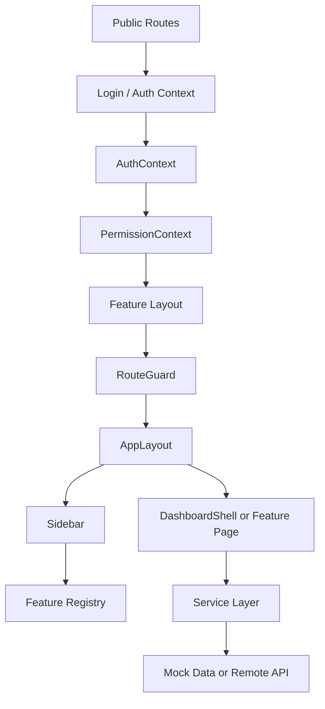
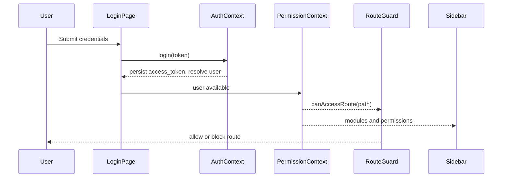
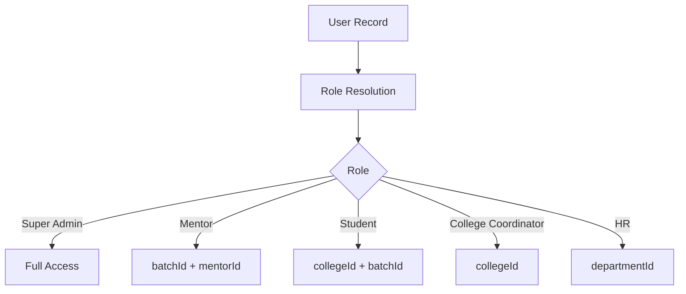
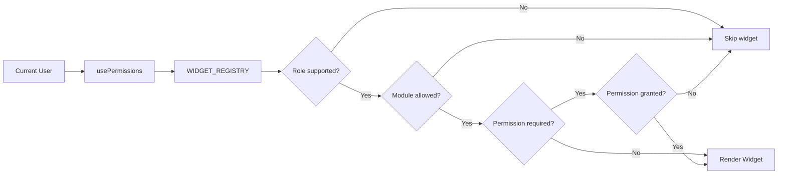
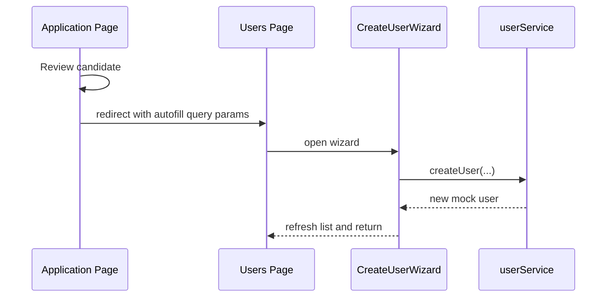
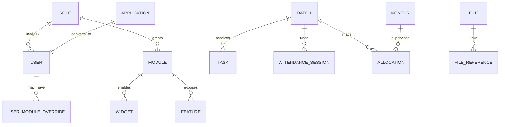

# Pinesphere ERP Enterprise Technical Report

Generated from the current repository implementation in `frontend/` and the accompanying documentation files. This report is intentionally strict about what is implemented versus what is inferred.

## 1. Executive Summary

Pinesphere ERP is a Next.js 16 application that currently behaves as a frontend-first enterprise portal with a dynamic dashboard shell, role-aware navigation, and a layered mock/API service architecture.

The real center of gravity is not a backend domain service. It is the client-side access model:

- Authentication is simulated through local storage tokens and a developer user switch.
- Authorization is resolved from mock roles, modules, permissions, and route maps.
- Dashboard widgets and sidebar navigation are generated dynamically from registries.
- Many feature screens are functional UI shells backed by mock datasets.
- Several service wrappers already point to remote API endpoints, but those endpoints are not implemented in this repository.

The project is therefore best understood as an enterprise UI framework with a partial integration layer, not as a complete backend-backed ERP.

## 2. What Exists, What Is Mocked, What Is Missing

### Implemented

- Public landing page at `/`
- Login flow at `/login`
- Forgot-password flow at `/forgot-password`
- Application form at `/apply`
- Post-auth redirect at `/dashboard` to `/feature`
- Protected app shell under `/feature`
- Route-level and permission-level guarding
- Dynamic sidebar driven by the feature registry
- Dynamic dashboard widget rendering from the widget registry
- Feature pages for identity, HR, LMS, attendance, tasks, application review, organization management, mentor profile, and more
- Mock data catalogs for users, roles, modules, permissions, tasks, applications, attendance, mentors, allocations, files, performance, and related entities

### Mocked or Partially Mocked

- Token validation is local and storage-based, not server-verified.
- Role switching for development is supported through `dev_user_id`.
- Many services mutate in-memory mock arrays instead of calling a backend.
- Some pages display explicit `TODO: Waiting for backend endpoint` banners.
- Some API wrappers are fully defined but rely on an external server at `NEXT_PUBLIC_API_URL` or the default host in `src/config`.

### Not Found in This Repository

- No backend source code is present here.
- No actual database schema migrations are present here.
- No server-side authorization middleware is present here.
- No production auth provider or token refresh implementation is present here.

## 3. System Architecture

The app is built on Next.js App Router with a layered client-side architecture:

1. `app/` provides public pages and protected feature routes.
2. `AppProviders` installs auth and permission contexts.
3. `AuthContext` resolves the current mock user from storage.
4. `PermissionContext` turns that user into route, module, and permission checks.
5. `RouteGuard` blocks unauthorized route access.
6. `AppLayout` wraps protected pages with sidebar/navigation chrome.
7. Feature pages use service wrappers and registry-driven UI to render module-specific workspaces.

## 4. Runtime Flow

### 4.1 Public Entry Flow

The public landing page is rendered by `app/page.tsx`. It fetches opportunities from `opportunitiesService`, animates the hero section, and exposes a primary CTA that scrolls to the programs section. This page is the only obvious public marketing surface in the repository.

### 4.2 Login Flow

`app/login/page.tsx` performs login by calling `authApi.login()`. The API wrapper has two execution paths:

- If the credentials match a developer user in the client-side allowlist, a mock access token is returned and `dev_user_id` is stored.
- Otherwise, the request is sent to `${NEXT_PUBLIC_API_URL || 'http://13.60.249.106:8000'}/api/v1/auth/login`.

On success:

- `AuthContext.login()` stores `access_token` locally.
- The page stores `pinesphere_username`.
- Navigation redirects to `/dashboard`.

### 4.3 Protected App Flow

`/dashboard` immediately redirects to `/feature`.

`app/feature/layout.tsx` then:

- waits for auth state
- redirects anonymous users back to `/`
- wraps authenticated users in `AppLayout`
- wraps children in `RouteGuard`

`RouteGuard` blocks access if the current path is not allowed for the user’s module set.

### 4.4 Authorization Flow

Authorization is resolved client-side from three data sources:

- mock roles
- mock user records
- mock module registry

`PermissionContext` answers:

- `hasPermission(permission)`
- `hasAnyPermission(permissions)`
- `hasModule(moduleId)`
- `canAccessRoute(route)`

Route access is derived from `ROUTE_MODULE_MAP`. Module membership is the primary gate, while `permissions` drive action-level visibility inside pages.

## 5. Identity and Access Model

### 5.1 Mock Entities

The core identity model is defined in `frontend/src/data/`:

- `mock-users.ts`
- `mock-roles.ts`
- `mock-modules.ts`
- `mock-permissions.ts`

These files define the platform personas and the navigation/security surface.

### 5.2 Role Semantics

The current role model includes:

- Student
- Mentor
- HR
- College Coordinator
- Super Admin

`Super Admin` is the only role with the `all` permission, which makes it a universal bypass in both module and route checks.

### 5.3 Module Resolution

`AuthContext.resolveAuthUser()` merges:

- the user’s role module list
- any `moduleOverrides`# PHASE 2 — INTERNSHIP OPERATIONS IMPLEMENTATION

You are continuing the Pinesphere ERP project.

IMPORTANT:
Do NOT redesign the architecture.
Strictly follow the existing project architecture and documentation.

The project already has:

- Next.js App Router
- React + TypeScript
- TailwindCSS
- Registry Driven Navigation
- Widget Registry
- Feature Registry
- Route Guards
- Permission Guards
- Auth Context
- Permission Context
- Service Layer
- API Layer
- Mock Data Layer
- Enterprise Folder Structure

Everything you build MUST integrate into the existing architecture.

====================================
OBJECTIVE
====================================

Implement Phase 2:

Internship Operations.

This phase adds the operational workflow after students join the internship.

DO NOT MODIFY EXISTING MODULES.

Only extend the architecture.

====================================
MODULES TO IMPLEMENT
====================================

1. Reporting Manager Module

2. Leave Management

3. Activity Tracking

4. Escalation Engine

====================================
GENERAL RULES
====================================

Follow the existing architecture:

Page

↓

Feature Component

↓

Service

↓

API

↓

Mock Repository

Every module must have:

- Types
- Mock Data
- API
- Service
- Page
- Components
- Drawers
- Tables
- Forms
- Registry Entry
- Sidebar Integration
- Permission Keys
- Module Registration

Never fetch data directly inside components.

Business logic belongs inside services.

====================================
1. REPORTING MANAGER MODULE
====================================

Create new feature:

feature-reporting-manager

Route:

/feature/reporting-manager

Permission Prefix:

reporting_manager.*

Required Permissions:

reporting_manager.view

reporting_manager.create

reporting_manager.edit

reporting_manager.review

reporting_manager.approve

reporting_manager.assign

Dashboard should include:

• Assigned Interns

• Pending Attendance Approval

• Pending Leave Requests

• Pending Assignment Reviews

• Pending Assessment Reviews

• Performance Summary

• Upcoming Deadlines

Pages

Dashboard

Intern Directory

Reviews

Approvals

Performance

Feedback

Each Intern should display

Profile

Batch

College

Attendance %

Assessment %

Task Completion

Performance Score

Risk Level

Current Status

Actions

Approve Attendance

Approve Leave

Review Assignment

Review Assessment

Submit Evaluation

Recommend Certificate

Components

ReportingManagerDashboard

AssignedInternTable

PerformanceCards

PendingApprovalTable

EvaluationDrawer

InternProfileDrawer

PerformanceChart

Services

reportingManager.service.ts

API

reportingManager.api.ts

Mock Data

mock-reporting-managers.ts

mock-manager-assignments.ts

mock-manager-evaluations.ts

====================================
2. LEAVE MANAGEMENT
====================================

Create module

feature-leave

Route

/feature/leave

Permission Prefix

leave.*

Permissions

leave.view

leave.create

leave.edit

leave.delete

leave.approve

leave.reject

leave.export

Pages

Leave Dashboard

Leave Requests

Leave Approval

Leave Calendar

Leave History

Features

Student Leave Request

Mentor Leave Request

Reporting Manager Approval

HR Approval

Coordinator Approval

Leave Types

Medical

Casual

Emergency

OD

WFH

Fields

Reason

Start Date

End Date

Supporting Document

Status

Timeline

Components

LeaveForm

LeaveApprovalDrawer

LeaveCalendar

LeaveTimeline

LeaveStatistics

Mock Repository

mock-leaves.ts

Services

leave.service.ts

====================================
3. ACTIVITY TRACKING
====================================

Create

feature-activity

Purpose

Complete Audit Trail.

Track every activity.

Track

Login

Logout

Attendance

Task Submission

Assessment Attempt

Assignment Upload

Download

Certificate Generation

Profile Update

Leave Request

Payment

Fields

Activity ID

User

Role

Module

Action

Description

Timestamp

Device

Browser

IP

Status

Severity

Filters

User

Role

Date

Module

Action

Status

Pages

Activity Dashboard

Activity Logs

User Timeline

Analytics

Components

ActivityTable

Timeline

ActivityChart

ActivityFilters

Mock Data

mock-activities.ts

Service

activity.service.ts

====================================
4. ESCALATION ENGINE
====================================

Create

feature-escalation

Purpose

Automatic workflow escalation.

Escalation Types

Attendance

Assignments

Leave

Assessments

Performance

Payment

Certificate Approval

Rules

Attendance

Absent 1 Day

↓

Notify Student

Absent 3 Days

↓

Notify Reporting Manager

Absent 5 Days

↓

Notify HR

Absent 7 Days

↓

Notify Coordinator

Assignment

Missed Deadline

↓

Reminder

↓

Manager

↓

HR

Leave

Pending Approval

↓

Reminder

↓

Manager

↓

HR

Assessment

Pending Review

↓

Reminder

↓

Mentor

↓

Manager

Pages

Escalation Dashboard

Rule Management

Pending Escalations

History

Analytics

Components

EscalationRuleEditor

EscalationTable

EscalationTimeline

EscalationDashboard

Mock Data

mock-escalations.ts

Service

escalation.service.ts

====================================
REGISTRY INTEGRATION
====================================

Register every module inside

FEATURE_REGISTRY

Add icons

Routes

Permissions

Sidebar Groups

====================================
DASHBOARD
====================================

Add widgets

Reporting Manager KPIs

Pending Leave Requests

Pending Reviews

Today's Attendance

Escalations

Risk Students

Upcoming Reviews

Widgets must be permission-aware.

====================================
RBAC
====================================

Create permissions

Reporting Manager

Leave

Activity

Escalation

Assign modules to

Super Admin

HR

Reporting Manager

Mentor

Coordinator

Student

Follow existing permission architecture.

====================================
MOCK DATA
====================================

Use realistic enterprise datasets.

Generate

50+

Leave Requests

100+

Activities

25+

Escalations

20+

Reporting Managers

200+

Manager Assignments

====================================
SERVICES
====================================

Every module must include

CRUD

Filtering

Searching

Sorting

Pagination

Statistics

Dashboard KPIs

Timeline generation

====================================
UI REQUIREMENTS
====================================

Use existing design system.

Do NOT redesign.

Reuse

Cards

Tables

Badge

Drawer

Modal

Charts

Buttons

Status Chips

Timeline

Use responsive layouts.

====================================
DOCUMENTATION
====================================

After implementation generate

1.

Module Documentation

2.

Folder Structure

3.

Permission Matrix

4.

API Contracts

5.

Mock Data Structure

6.

Workflow Diagrams

7.

ER Diagram Updates

8.

Component Tree

9.

Service Flow

10.

Implementation Summary

====================================
QUALITY REQUIREMENTS
====================================

No placeholders.

No TODO comments.

No duplicated logic.

Strict TypeScript.

Proper separation of concerns.

Reusable components.

Production-ready architecture.

Every feature must compile successfully.

Maintain compatibility with all existing modules.

Do not break existing functionality.

Then it intersects that set with the active modules list.

This means a user can be granted an extra module beyond their role defaults, but only if the module exists and is active.

### 5.4 Permission Resolution

Permissions are plain strings such as:

- `dashboard.view`
- `student.create`
- `application.review`
- `common_file.upload`

Most role definitions only include a subset of CRUD and workflow permissions. The feature screens use these strings directly through `PermissionGuard`.

### 5.5 Scope Resolution

`src/core/security/ScopeResolver.ts` implements a row-level access inference layer. It does not connect to a backend, but it expresses the intended policy:

- `Super Admin` gets unrestricted scope
- `College Coordinator` is scoped to `collegeId`
- `Mentor` is scoped to `batchId` and `mentorId`
- `Student` is scoped to `collegeId` and `batchId`
- `HR` is scoped primarily through department affiliation

This is architectural intent, not an enforced server policy.

## 6. Navigation and Route Mapping

### 6.1 Public Routes

- `/` landing page
- `/login`
- `/forgot-password`
- `/apply`
- `/success`

### 6.2 Protected Shell

- `/dashboard` redirects to `/feature`
- `/feature` is the dashboard home
- `/feature/*` holds the feature modules

### 6.3 Route-to-Module Mapping

`ROUTE_MODULE_MAP` is the canonical source of truth for route authorization. It maps the URL path to the logical module ID.

Examples:

- `/feature/users` -> `users`
- `/feature/roles` -> `roles`
- `/feature/application` -> `application`
- `/feature/attendance` -> `attendance`
- `/feature/my-attendance` -> `my_attendance`
- `/feature/super-admin` -> `super_admin`

If a route is unknown, `PermissionContext.canAccessRoute()` denies access by default.

## 7. Dashboard Rendering

`components/dashboard/DashboardShell.tsx` is the dynamic dashboard entry surface.

It filters `WIDGET_REGISTRY` by:

- supported role
- module membership
- specific permission key

Then it renders one of a fixed set of widget components.

This design matters because the dashboard is not hardcoded per role. It is registry-driven, so adding a widget requires updating the registry and renderer rather than hand-wiring the shell.

### Widget Coverage

The registry currently defines widgets for:

- system health
- recent activity
- employee KPI
- applications KPI
- program statistics
- assigned students
- pending reviews
- attendance summary
- learning progress
- upcoming tasks

## 8. Feature Registry

`src/core/features/feature-registry.ts` drives the sidebar and the feature catalog.

It defines:

- `moduleId`
- `featureId`
- `permissionKey`
- `displayName`
- `navigationLabel`
- `route`
- `icon`

The sidebar consumes this registry directly, so feature navigation is generated instead of curated manually.

This is the key reason the app can scale to many modules without a bespoke navigation tree.

## 9. Service Layer

The service layer has two patterns.

### 9.1 Pure Mock Services

Examples:

- `role.service.ts`
- `user.service.ts`
- `module.service.ts`
- `permission.service.ts`
- `attendance.service.ts`
- `task.service.ts`
- `assessment.service.ts`
- `session.service.ts`
- `mentor.service.ts`
- `coordinator.service.ts`
- `allocation.service.ts`
- `performance.service.ts`
- `lms.service.ts`
- `file.service.ts`
- `super-admin.service.ts`
- `submission.service.ts`
- `studentDashboard.service.ts`

These services mostly read and mutate mock arrays in memory.

### 9.2 API-Backed Wrappers

Examples:

- `auth.api.ts`
- `student.api.ts`
- `application.api.ts`
- `program.api.ts`
- `organization.api.ts`
- `employee.api.ts`
- `batch.api.ts`
- `opportunity.api.ts`

These wrappers target a remote API using a shared Axios client.

### 9.3 Mixed Services

Some higher-level services map API responses into richer UI models:

- `student.service.ts`
- `application.service.ts`
- `program.service.ts`
- `organization.service.ts`
- `employee.service.ts`
- `opportunities.service.ts`

These adapters exist because the UI wants more fields than the remote API shape provides.

### 9.4 Service Implications

The app is currently in a transitional architecture:

- the UI is already designed for service isolation
- the mock layer lets the product run without a backend
- the API wrappers define the likely backend contract

That means backend integration can happen incrementally per module.

## 10. API Communication

### 10.1 Shared HTTP Client

`src/api/api.client.ts` creates an Axios instance with:

- `Content-Type: application/json`
- Authorization header injection from `access_token`
- a response interceptor scaffold for refresh token handling

The default base URL is:

- `NEXT_PUBLIC_API_URL`
- fallback: `http://13.60.249.106:8000`

### 10.2 Login Exception

`auth.api.ts` includes a developer shortcut:

- known demo credentials return local mock tokens
- the selected dev user is stored in `dev_user_id`

This is useful for testing multiple personas without a backend.

### 10.3 Request Surface

The API wrappers imply the backend contract expects endpoints for:

- authentication
- users
- students
- applications
- programs
- organizations
- employees
- batches
- opportunities

But those endpoints are not implemented here.

## 11. Feature Modules

### 11.1 Identity

Implemented screens:

- Users
- Roles
- Permissions
- Sessions
- Security Center

Main behavior:

- user table with CRUD actions
- role cards with module counts and user counts
- security dashboard with mock login activity
- permission-managed action buttons through `PermissionGuard`

### 11.2 Application

The application page is one of the more complete workflows in the repository.

It supports:

- application list and filtering
- review workspace
- status changes
- review scoring
- approval flow into user creation
- autofill handoff to the user wizard

The page uses `applicationService` and `opportunitiesService`, then maps backend-like shapes into UI-friendly records.

### 11.3 Users

The user page supports:

- table listing
- create/edit/view wizard
- status toggle
- delete action
- autofill from the application approval flow

### 11.4 Roles

The role page supports:

- create role wizard
- edit/view role wizard
- module assignment
- permission assignment

### 11.5 Organization

The organization page is a rich management surface for:

- colleges
- departments
- coordinators
- students
- programs
- placements
- documents
- timeline events

It is heavily UI-driven and uses local derived state for filtering, summaries, and leaderboards.

### 11.6 Mentor

The mentor profile page supports:

- listing mentor profiles
- drawer detail view
- availability toggling

### 11.7 LMS

Implemented LMS screens are mostly mock dashboards and learning cards:

- LMS dashboard
- My Learning

### 11.8 Attendance

Attendance includes:

- attendance dashboard
- session directory
- create session
- my attendance view with simulated check-in and check-out

### 11.9 Task

Task management includes:

- dashboard KPIs
- directory of tasks
- task detail drawer
- student task submission workflow

### 11.10 Files

The file service models:

- upload
- delete
- reference mapping

The `common_file` module is exposed in permissions and navigation, but the actual page implementation should be treated as a feature surface rather than a completed document-management system.

## 12. Workflows

### 12.1 Application to User Creation

1. Applicant record is loaded in the application module.
2. Reviewer updates status or score.
3. Approved candidate is routed to `/feature/users` with autofill query parameters.
4. Create User wizard opens with candidate name, email, and phone prefilled.
5. User is created in the mock layer.

### 12.2 Student Attendance Check-In

1. Student opens My Attendance.
2. Page fetches attendance logs and status.
3. User checks in.
4. UI updates `isCheckedIn`, `clockInTime`, and attendance log optimistically.
5. User can later check out.

### 12.3 Task Submission

1. Student selects a task.
2. Student supplies GitHub URL and a ZIP filename in the simulated workflow.
3. Submission changes task state to review.
4. UI shows the under-review state.

### 12.4 Role Creation

1. Admin opens the role wizard.
2. Role metadata is entered.
3. Modules are assigned.
4. Permissions are fetched per module and selected.
5. The role is created in the mock store.

## 13. Data Model

There is no backend schema in this repository, so this section describes the logical model exposed by the mock data files.

### Core identity model

- `users`
- `roles`
- `modules`
- `permissions`

### Operational model

- `applications`
- `students`
- `programs`
- `organizations`
- `employees`
- `batches`
- `allocations`
- `mentors`
- `attendance`
- `tasks`
- `submissions`
- `performance`
- `files`

### Relationships inferred from the implementation

- one role has many modules
- one user belongs to one role
- one user can override modules
- one batch can contain many students
- one mentor can be mapped to many batches
- one application can become one user
- one program can contain many learning modules
- one file can reference many entity records through the reference table

## 14. Mock Data Catalog

This repository uses mock data as the operational truth for most screens. The mock datasets are not random placeholders; they are structured to simulate the enterprise lifecycle from opportunity posting to application review, student onboarding, batch allocation, learning delivery, attendance, tasks, and placements.

### 14.1 Identity Data

#### `mock-users.ts`
- Contains: super admin, student, mentor, HR, and college coordinator seed users.
- Purpose: drives login persona switching, ownership examples, and access scoping.
- Important fields: `roleId`, `roleName`, `moduleOverrides`, `collegeId`, `batchId`, `departmentId`.
- Output on UI: user tables, auth resolution, and `dev_user_id` persona switching.

#### `mock-roles.ts`
- Contains: Student, Mentor, HR, College Coordinator, Super Admin roles.
- Purpose: defines role-to-module and role-to-permission mapping.
- Important fields: `moduleIds`, `permissions`, `modulesCount`, `usersCount`.
- Output on UI: role cards and role wizard module/permission selection.

#### `mock-modules.ts`
- Contains: dashboard, identity, HR, mentor, LMS, attendance, task, assessment, submission, performance, files, and super-admin modules.
- Purpose: canonical module registry for navigation and access checks.
- Important fields: `id`, `code`, `name`, `route`, `active`.
- Output on UI: sidebar links, dashboard authorization, and route gating.

#### `mock-permissions.ts`
- Contains: granular CRUD and workflow permissions for every module.
- Purpose: provides the permission keyspace used by guards and role configuration.
- Important fields: `id`, `module`, `action`, `label`.
- Output on UI: permission matrix, action buttons, and route/module mapping.

#### `mock-user-sessions.ts`
- Contains: active and expired sessions for a student, super admin, and another user.
- Purpose: backs the sessions/security surface.
- Important fields: `device`, `os`, `browser`, `ipAddress`, `location`, `lastActivity`, `status`.
- Output on UI: session table and termination actions.

#### `mock-password-history.ts`
- Contains: password reuse/rotation history records.
- Purpose: security and password-policy reference data.
- Output on UI: password-related security panels if surfaced by the page.

### 14.2 Public Funnel Data

#### `mock-opportunities.ts`
- Contains: open, draft, and closed opportunity listings across tech, design, analytics, and sales.
- Purpose: powers the landing page and opportunity management flow.
- Important fields: `title`, `type`, `value`, `description`, `duration`, `mode`, `seats`, `eligibility`, `status`, `programId`.
- Output on UI: landing programs section and opportunity management cards.

#### `mock-applications.ts`
- Contains: applicant records with personal, academic, professional, internship-type, review, payment, and AI-assistance data.
- Purpose: drives application review, scoring, approval, and onboarding handoff.
- Important fields: `candidateName`, `college`, `cgpa`, `skills`, `status`, `reviewScore`, `overallRecommendation`, `paymentVerified`, `aiMatchPercentage`.
- Output on UI: application pipelines, scoring workspace, filters, and review drawers.

#### `mock-students.ts`
- Contains: enrolled student profiles with personal, academic, internship, documents, credentials, batch, mentor, performance, placement, and timeline data.
- Purpose: models the post-approval student lifecycle.
- Important fields: `internId`, `status`, `documents`, `credentials`, `performance`, `placement`.
- Output on UI: student management screens and downstream relationship screens.

### 14.3 Program, Batch, and Allocation Data

#### `mock-programs.ts`
- Contains: program definitions, curriculum modules, enrollments, mentors, analytics, certification counts, metadata, and timelines.
- Purpose: represents the enterprise program shell that cohorts are attached to.
- Important fields: `title`, `status`, `type`, `curriculum`, `analytics`, `certifications`, `metadata`.
- Output on UI: program pages, analytics panels, and curriculum views.

#### `mock-batches.ts`
- Contains: cohort/batch records with students, mentors, projects, performance, metadata, and timelines.
- Purpose: models delivery units inside a program.
- Important fields: `capacity`, `students`, `mentor`, `projects`, `performance`, `status`.
- Output on UI: batch dashboard, student lists, capacity charts, and lifecycle timelines.

#### `mock-allocations.ts`
- Contains: mapping records from student to program, batch, mentor, and college.
- Purpose: the relationship layer used by allocation management.
- Important fields: `studentId`, `programId`, `batchId`, `mentorId`, `collegeId`, `status`, `timeline`.
- Output on UI: allocation dashboards, conflict handling, and reassignment flows.

### 14.4 Delivery and Tracking Data

#### `mock-attendance.ts`
- Contains: attendance sessions, session records, a live student attendance status snapshot, and attendance logs.
- Purpose: supports both cohort attendance administration and student self check-in.
- Important fields: `sessionId`, `studentId`, `status`, `clockIn`, `clockOut`, `averageAttendance`, `isCheckedIn`.
- Output on UI: attendance dashboard, session list, check-in/out states, and student attendance history.

#### `mock-tasks.ts`
- Contains: tasks and assignees with review/completion/overdue state.
- Purpose: drives task dashboard and student assignment views.
- Important fields: `batchId`, `assignedBy`, `dueDate`, `status`, `isOverdue`, `alert`.
- Output on UI: task KPIs, directory table, escalation monitor, and task submission state.

#### `mock-submissions.ts`
- Contains: submission objects with repository links, live links, subtasks, commits, marks, and file references.
- Purpose: powers submission review and mentor grading flows.
- Important fields: `repoLink`, `liveLink`, `subtasks`, `commits`, `status`, `marksObtained`.
- Output on UI: submission directory, review drawer, and approval/rejection workflow.

#### `mock-assessments.ts`
- Contains: assessments and assessment submissions.
- Purpose: powers the assessment module and grading views.
- Important fields: `type`, `status`, `batchId`, `title`, `submissions`.
- Output on UI: assessment dashboard, directory, and submission drawers.

#### `mock-performance.ts` and `mock-performances.ts`
- Contains: student-level and batch-level performance snapshots.
- Purpose: feeds KPI views and risk detection.
- Important fields: `average_score`, `attendance_rate`, `task_completion_rate`, `assessment_score`, `isAtRisk`.
- Output on UI: performance dashboards and risk monitoring.

### 14.5 Learning and Content Data

#### `mock-learning-modules.ts`
- Contains: LMS modules with images, progress, and resources.
- Purpose: drives My Learning and LMS dashboard content.
- Important fields: `programId`, `title`, `category`, `progress`, `resources`.
- Output on UI: learning cards, resource completion states, and progress bars.

#### `mock-common-files.ts`
- Contains: generic uploaded files and file-to-entity references.
- Purpose: simulates file storage and relationship tagging.
- Important fields: `file_type`, `file_size`, `uploaded_by`, `storage_url`, `version`, `entity_type`.
- Output on UI: file lists, attachments, and resource references.

### 14.6 Mentor and Coordinator Data

#### `mock-mentors.ts`
- Contains: mentor profiles with expertise, capacity, availability, and timestamps.
- Purpose: supports mentor profile management and availability toggling.
- Important fields: `mentor_profile_id`, `employee_id`, `mentor_expertise`, `current_student_count`, `is_available`.
- Output on UI: mentor profile tables and profile drawers.

#### `mock-mentor-assignments.ts`
- Contains: mentor-to-student or mentor-to-batch assignments.
- Purpose: models mentoring relationships separate from the employee directory.

#### `mock-mentor-batch-mappings.ts`
- Contains: mentor-to-batch mappings.
- Purpose: supports cohort supervision and mentor routing.

#### `mock-coordinators.ts`
- Contains: coordinator records and college reports.
- Purpose: backs the college coordinator view and reporting surfaces.

#### `mock-coordinator.ts`
- Contains: coordinator summary stats and batch performance slices.
- Purpose: feeds a lighter-weight coordinator dashboard summary view.

### 14.7 Organization and Employee Data

#### `mock-organizations.ts`
- Contains: college/org records with departments, coordinators, students, programs, placement analytics, documents, and timeline events.
- Purpose: models the institutional relationship layer.
- Important fields: `code`, `type`, `headcount`, `partnershipStatus`, `departments`, `coordinators`, `students`, `programs`, `placementAnalytics`, `documents`.
- Output on UI: organization dashboard, filters, profiles, and placement analytics.

#### `mock-employees.ts`
- Contains: employee profiles with documents, attendance, leaves, mentor metrics, access control, audit trails, performance reviews, and projects.
- Purpose: the HR master record that other modules can attach to.
- Important fields: `designation`, `organizationId`, `mentorMetrics`, `performance`, `timeline`.
- Output on UI: employee management lists and detail drawers.

### 14.8 Super Admin and Governance Data

#### `mock-super-admin.ts`
- Contains: platform settings, audit logs, and role-permission summaries.
- Purpose: drives the super admin governance page.
- Important fields: `category`, `key`, `value`, `action`, `entityType`, `status`, `permissions`.
- Output on UI: system health, global settings, audit logs, and role permission panels.

### 14.9 What the Mock Data As A Whole Represents

Taken together, the mock data models a full enterprise training lifecycle:

1. Opportunity is published.
2. Candidate applies.
3. Application is reviewed.
4. Student record is created.
5. Student is assigned to a program, batch, mentor, and college.
6. Learning modules, tasks, attendance, and assessments begin.
7. Submissions and performance are tracked.
8. Files, sessions, and governance records provide operational support.

That is why the mock data is so large: it is intentionally covering the end-to-end domain graph needed by the UI.

## 15. Security Model

### 14.1 What Is Actually Enforced

- route blocking in the client
- module gating in the client
- permission checks in the client
- super admin bypass through the `all` permission

### 14.2 What Is Only Inferred

- row-level security
- backend JWT validation
- server-side RBAC
- audit logging

These are reasonable enterprise requirements, but they are not implemented in this repository.

### 14.3 Risk Notes

Because the guard model is client-side:

- users can hide UI elements, but this is not a security boundary
- any real deployment still needs server-side authorization
- token storage in `localStorage` increases exposure to XSS if the app is compromised

## 16. Deployment and Configuration

### 15.1 Build and Run

The project uses standard Next.js scripts:

- `npm run dev`
- `npm run build`
- `npm run start`
- `npm run lint`

### 15.2 Environment

The primary runtime configuration is `NEXT_PUBLIC_API_URL`.

If unset, the app falls back to the hardcoded remote host found in `src/api/api.client.ts` and `src/config/index.ts`.

### 15.3 Styling and Frontend Runtime

The app uses:

- Next.js App Router
- React 19
- Tailwind CSS 4
- Lucide icons
- Geist font
- local animation classes and utility-first component styling

## 17. Important Implementation Gaps

These are the main areas a maintainer should treat as incomplete:

1. Backend services are not present in this repo.
2. Server-side auth and authorization are not present in this repo.
3. Many API wrappers have no local implementation behind them.
4. Some service methods mutate global mock arrays, which is fine for UI prototyping but not durable state.
5. A number of screens still contain explicit backend TODO banners.
6. There is no centralized query cache or global store in active use despite React Query and Zustand being installed.

## 18. Maintenance Guidance

If the next step is backend integration, the safest order is:

1. Define server contracts for the API-backed wrappers.
2. Replace mock service methods one module at a time.
3. Move route and permission enforcement to the server.
4. Replace localStorage auth with a safer production auth strategy.
5. Keep the registries as the source of truth for navigation and dashboard composition.

If the next step is frontend expansion, add new capability in this order:

1. Add a module entry to `MOCK_MODULES`.
2. Add a role mapping if needed.
3. Add route-to-module mapping in `ROUTE_MODULE_MAP`.
4. Add feature registry entries.
5. Add permission strings.
6. Gate the new UI with `PermissionGuard`.

## 19. Page Input/Output Reference

This is the practical guide you asked for: each route below shows what the page consumes as input and what it emits as output. "Input" includes form fields, query parameters, clicks, service data, and local state. "Output" includes rendered content, state transitions, redirects, toasts, drawers, and mutated mock data.

### 18.1 Public and Auth Pages

#### `/`
- Input: remote/mock opportunity list from `opportunitiesService`, scroll click on "Explore More", browser hash `#programs`.
- Output: hero landing page, navigation header, opportunity/program section, smooth scroll behavior, and an initial fetch state with fallback empty list on failure.

#### `/login`
- Input: `username` and `password` form fields, submit event, developer credentials from the client-side allowlist, optional `localStorage` values.
- Output: success toast, `access_token` persistence, `dev_user_id` persistence for demo users, redirect to `/dashboard`, or an error toast when auth fails.

#### `/forgot-password`
- Input: username, OTP, new password, confirm password, resend timer state.
- Output: 4-step reset UI, OTP countdown, success redirect to `/login`, validation warnings, and backend request attempts via `API_ENDPOINTS.FORGOT_PASSWORD_*`.

#### `/apply`
- Input: multi-step form data for personal, academic, professional, internship-specific, document, and motivation sections; `type` query parameter; local draft storage.
- Output: form wizard UI, autosaved draft, validation feedback, and a submit request to the application endpoint contract; on success it should navigate to `/success`.

#### `/success`
- Input: `type` query parameter, optional telemetry request to `API_ENDPOINTS.SUCCESS_DATA`.
- Output: success/confirmation card, success telemetry toast, and context-sensitive CTA back to `/` or `/dashboard`.

### 18.2 Shell and Infrastructure Pages

#### `/dashboard`
- Input: no user form input; only routing.
- Output: immediate redirect to `/feature`.

#### `/feature`
- Input: resolved auth user from context and route protection state.
- Output: `DashboardShell`, which renders role-specific widgets based on module and permission checks.

#### `/feature/layout`
- Input: authenticated user state from `AuthContext`.
- Output: global app chrome via `AppLayout`, route blocking via `RouteGuard`, and redirect to `/` for anonymous users.

#### `app/layout`
- Input: application-wide React tree.
- Output: global fonts, metadata, and provider wrapping through `AppProviders`.

### 18.3 Identity and Security Pages

#### `/feature/users`
- Input: search parameters `autofill`, `name`, `email`, `phone`, `redirect`; button clicks; table actions; user data from `userService`.
- Output: user directory table, create/edit/view wizard, status toggle, delete flow, and autofill-to-create workflow when a candidate is approved from applications.

#### `/feature/roles`
- Input: create/edit/view actions, role dataset from `roleService`.
- Output: role cards, create role wizard, edit/view drawer state, and delete confirmation.

#### `/feature/permissions`
- Input: permission registry and module selection state.
- Output: permission matrix and permission browsing UI, typically driven by `permissionService` and registry data.

#### `/feature/sessions`
- Input: session records from `sessionService`, terminate action on a session row.
- Output: session list/table, terminate action result, and updated session status.

#### `/feature/security`
- Input: no user form input; static security metrics and mock event data.
- Output: security KPI cards, login trend charts, and recent security events list.

#### `/feature/super-admin`
- Input: tab selection and data from `superAdminService`.
- Output: system health metrics, settings view, audit log view, and role-permission overview.

### 18.4 HR and Organization Pages

#### `/feature/employee`
- Input: employee search, create/edit/delete actions, employee service data.
- Output: employee table, create employee workflow, status and department-related UI.

#### `/feature/organization`
- Input: search and filter fields, selection state, profile drawer triggers, edit/onboard modal triggers, and organization service data.
- Output: college/organization dashboard, filtered directories, profile drawers, leaderboard panels, document metadata views, and timeline feeds.

#### `/feature/program`
- Input: program search, create/edit actions, and program service data.
- Output: program dashboard/listing, create program wizard, and program detail management.

#### `/feature/opportunity`
- Input: opportunity form fields, view/edit triggers, and opportunity service data.
- Output: opportunity listing and creation workflow, plus a detail preview/edit drawer.

#### `/feature/application`
- Input: application filters, review sliders, notes, payment verification actions, bulk selection, and application/opportunity service data.
- Output: pipeline dashboard, application directory, review workspace, status updates, bulk operations, and the redirect to user creation when a candidate is approved.

#### `/feature/coordinator`
- Input: coordinator listing data from `coordinatorService` and report selection.
- Output: coordinator overview and report panels scoped to the coordinator.

#### `/feature/batch`
- Input: search and filter values, batch edit forms, selected batch IDs, and batch service data.
- Output: batch dashboard, directory, profile drawer, lifecycle/timeline panels, and bulk batch actions.

#### `/feature/allocation`
- Input: allocation search/filter values, allocation form state, capacity/rule settings, selected allocation IDs, and allocation/student/batch data.
- Output: allocation dashboard, relationship mapping directory, conflict/rule panels, bulk reallocation tools, and a selected-allocation detail drawer.

#### `/feature/batch-mapping`
- Input: mentor/batch mapping data and assignment actions.
- Output: mapping directory and mentor-to-batch relationship views.

### 18.5 Mentorship and Student Pages

#### `/feature/mentor/profile`
- Input: mentor profile list from `mentorService`, search term, availability toggle, drawer open/close.
- Output: mentor profile table, detail drawer, and availability state updates.

#### `/feature/student`
- Input: student list, search/filter inputs, create/edit/status actions, and student service data.
- Output: student table, profile/details workspace, batch/mentor context, and action flows.

#### `/feature/my-attendance`
- Input: attendance logs/status from `attendanceService`, check-in/check-out button clicks.
- Output: live attendance card, compliance meter, optimistic toast messages, and updated log list.

#### `/feature/my-learning`
- Input: learning module data from `lmsService`.
- Output: student learning cards with progress bars, resource lists, and completion indicators.

#### `/feature/my-tasks`
- Input: selected task, deliverable form fields, simulated file attachment.
- Output: task cards, submission form, validation toasts, and optimistic state transition from pending to review.

### 18.6 LMS, Task, Attendance, and Assessment Pages

#### `/feature/lms`
- Input: static dashboard data and KPI state.
- Output: LMS analytics cards, completion charts, and storage metrics.

#### `/feature/task`
- Input: task data from `taskService`, search term, selected task, drawer tabs.
- Output: dashboard KPIs, task directory, task detail drawer, and assignee/submission/comment views.

#### `/feature/management`
- Input: task management controls and task workflow data.
- Output: workflow management surface for task operations and escalations.

#### `/feature/attendance`
- Input: search term, active tab, batch ID prompt on create, session data from `attendanceService`.
- Output: attendance dashboard metrics, session directory, create session behavior, and mark-attendance action links.

#### `/feature/assessment`
- Input: search term, selected assessment, assessment submissions, drawer tabs, and assessment service data.
- Output: assessment dashboard metrics, assessment directory, submission drawer, and quiz/coding/project type indicators.

#### `/feature/submissions`
- Input: submission dataset from `submissionService`, selected submission, view mode state.
- Output: submission dashboard KPIs, recent submissions list, detailed submission view, and approval/rejection actions if wired in the full page.

#### `/feature/performance`
- Input: performance dataset from `performanceService` and any page filters.
- Output: performance dashboard metrics and student/batch performance visualizations.

### 18.7 System Page Behavior by Page Type

To make the above easier to maintain, the pages fall into four patterns:

- Dashboard pages: consume service data and render KPIs, charts, and summary cards.
- Directory pages: consume search/filter input and render tables, drawers, and bulk actions.
- Workflow pages: consume form input and emit optimistic state changes, toasts, and redirects.
- Access-control pages: consume auth/permission context and emit either content or an access-restricted fallback.

### 18.8 Common Inputs and Outputs by Screen Category

- Form pages usually accept text fields, dropdowns, status toggles, and file-related inputs.
- Table pages usually accept search strings, filter chips, pagination, row actions, and selection state.
- Drawer pages usually accept selected entity IDs and emit preview/edit side panels.
- Guarded pages usually accept no direct user input and emit either the protected page or an access restriction.

## 20. Source Files Referenced

- `/Users/test/Documents/simp/frontend/app/layout.tsx`
- `/Users/test/Documents/simp/frontend/app/page.tsx`
- `/Users/test/Documents/simp/frontend/app/dashboard/page.tsx`
- `/Users/test/Documents/simp/frontend/app/feature/layout.tsx`
- `/Users/test/Documents/simp/frontend/app/login/page.tsx`
- `/Users/test/Documents/simp/frontend/app/forgot-password/page.tsx`
- `/Users/test/Documents/simp/frontend/app/apply/page.tsx`
- `/Users/test/Documents/simp/frontend/app/success/page.tsx`
- `/Users/test/Documents/simp/frontend/src/providers/AppProviders.tsx`
- `/Users/test/Documents/simp/frontend/src/context/AuthContext.tsx`
- `/Users/test/Documents/simp/frontend/src/context/PermissionContext.tsx`
- `/Users/test/Documents/simp/frontend/src/hooks/usePermissions.ts`
- `/Users/test/Documents/simp/frontend/src/core/security/ScopeResolver.ts`
- `/Users/test/Documents/simp/frontend/src/core/relationships/RelationshipResolver.ts`
- `/Users/test/Documents/simp/frontend/src/core/workflows/workflow-engine.ts`
- `/Users/test/Documents/simp/frontend/src/core/dashboard/widget-registry.ts`
- `/Users/test/Documents/simp/frontend/src/core/features/feature-registry.ts`
- `/Users/test/Documents/simp/frontend/src/data/mock-users.ts`
- `/Users/test/Documents/simp/frontend/src/data/mock-roles.ts`
- `/Users/test/Documents/simp/frontend/src/data/mock-modules.ts`
- `/Users/test/Documents/simp/frontend/src/data/mock-permissions.ts`
- `/Users/test/Documents/simp/frontend/src/api/api.client.ts`
- `/Users/test/Documents/simp/frontend/src/api/auth.api.ts`
- `/Users/test/Documents/simp/frontend/src/services/*.ts`
- `/Users/test/Documents/simp/frontend/components/guards/*.tsx`
- `/Users/test/Documents/simp/frontend/components/admin/ui/PermissionGuard.tsx`
- `/Users/test/Documents/simp/frontend/components/dashboard/DashboardShell.tsx`
- `/Users/test/Documents/simp/frontend/components/layout/Sidebar.tsx`

## 21. Final Assessment

The repository currently contains a strong enterprise UI architecture with:

- dynamic navigation
- registry-driven dashboards
- modular feature pages
- a workable mock identity model
- a clear path to backend integration

What it does not contain is the backend itself. The right way to read this project is as a frontend enterprise control plane with a well-shaped future integration contract.
